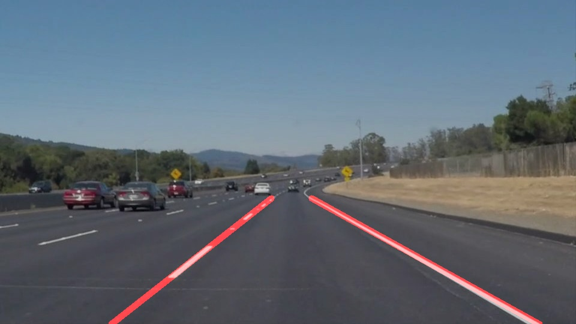

# **Finding Lane Lines on the Road** 

## Writeup

### Overview

---

**Finding Lane Lines on the Road**

The goals / steps of this project are the following:
* Make a pipeline that finds lane lines on the road
* Reflect on your work in a written report

[//]: # (Image References)

 

---

### Reflection

### 1. Describe your pipeline. As part of the description, explain how you modified the draw_lines() function.

My pipeline consists of 6 steps and an optional 7th steps. 

* Gray Scaling
* Gaussian Blur
* Canny Edge Detection
* Masking by Polygon
* Drawing Lines 
  - Line Detection 
    - Applying a Hough transform on the clipped and edged image.
    - Separating lines by negative and positive slope
    - Linear fit through all both start end end line points.
    - Use linear model to find start and end point for the resulting line  
  - Line Drawing
    - Draw detected road lines on empty image
* Draw detected edges on original image
* (optional) Draw clipping mask onto image in addition
An example result can be seen in the following image:

 

### 2. Identify potential shortcomings with your current pipeline

Potential shortcomings:
1. The road lines are clipped in the polygon masking stage. 
2. Sharp curves, e.g in construction sites, would would lead to insufficient line detection. In this case the two road lines might have positive (or negative) slope in image space at the same time. The mechanism that separates the lines by negative and positive slope would fail to distinguish between them properly  

### 3. Suggest possible improvements to your pipeline

Potential improvements:
1. One could adaptively change the clipping polygon in each image frame by using the information of the linear model in the previous frame.
2. To tackle this problem we need a more advanced procedure to separate the lines. A possible solution could be the application of clustering algorithms. Also a more complex fitting model could be chosen in order to account for bended road lines.
